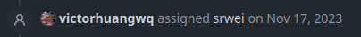

*Don't know what Dorion is? Take a look at the [GitHub repository](https://github.com/SpikeHD/Dorion)!*

Dorion just turned **3.191781** years old! Or alternatively, Dorion recently reached **1,000** stars!

Practically this doesn't mean much, other than maybe looking good on a resume[^1], but I still think that its a valuable milestone
as it's my first project to really reach an audience. It's been really fun sifting through issues, merging the occassional PR from someone
who cared enough about something to make one, and seeing the different ways people are using Dorion that I wouldn't have thought of (such as
the people who use it on Windows 7[^2][^3]).

Throughout it's life (and presently), Dorion was far from perfect. In fact I've even seen plenty of instances of people saying it's just... bad.
I don't disagree for the most part; by using uncontrollable system components (the system-integrated webview implementation, rather than Electron) I am cursing myself to be at the mercy
of the developers who write those components. This is a limitation [I am well aware of](https://github.com/SpikeHD/Dorion/issues/210) and I understand
if it makes Dorion unsuitable for some.

In this post I want to take you through the (short, I promise) history of Dorion, and explain some stuff throughout.

## Dorion Wasn't Even my Idea

Yep. I'm a fraud. A thief. A depraved idea stealer some might say.

Before working on Dorion, I was a part of [a team developing Genshin Impact private server software](https://github.com/grasscutters), a role I had fun with for
a game I desperately wish I could get my time back from. I wrote a launcher comprised of some of the worst code I'd ever written, then they saw it and asked if I wanted
to make an new launcher with them, so I helped write a second launcher using the [Tauri](github.com/tauri-apps/) library comprised of the second-worst code I'd ever written[^4].

After writing that project and understanding how Tauri worked, someone I was aquainted with mentioned how it might be interesting to make a Discord client using.
I believe they mentioned it with the intention of doing it themselves (and, to be clear, I don't think they care that I went and did it, it was pretty much a "what if?" scenario),
but it sparked an interest in me, so I took the idea and ran.

## The Beginning

Dorion's repo was created on the **6th of September, 2022**, and it's first release (0.1.0) was released the same day. At the time, Dorion didn't really even do anything other than load up
the Discord site, and the original release zip was *just* 2.4MB (these days it's more like 4.7MB, which is still insanely small compared to the official client).

One of the first things I ever did (because it was all I cared about) was custom stuff like theme support. At first, I didn't really want to touch client-side modding,
so things like the theme menu and settings were actually static pages injected into the client using terrible Javascript. This was very stupid,
and it didn't take long before I decided to incorporate the first iteration of some custom client modding in the form of a Vencord fork (that I have since deleted) in **July 2023**.

This worked just fine for a while, Dorion chugged along and I began to write more custom Rust implementations of features such as [rsRPC](https://github.com/spikeHD/rsrpc), which was first
included in **September 2023**. By this point Dorion had about 200 stars, which had already surpassed any other project of mine and was getting *real* feedback from *real* people,
much of it being [very encouraging](https://github.com/SpikeHD/Dorion/issues/31)!

At this point I should mention that many commits and releases were made in the middle of college lectures or insane hours of the night, so some releases had some...
[silly issues](https://github.com/SpikeHD/Dorion/releases/tag/v1.0.1) get resolved.

One day, [Discord updated and broke a bunch of stuff](https://github.com/SpikeHD/Dorion/issues/125), Vencord included. Since all of Dorion's internal updating and such was handled by Vencord,
Dorion users weren't just able to wait it out. This sparked the move to [shelter](https://github.com/uwu/shelter/) in the [2.0](https://github.com/SpikeHD/Dorion/releases/tag/v2.0.0) release,
as their whole philosophy is resiliency and "and attempt to prepare for the worst". This also forced me to move all of the special client-side Dorion functionality (think settings menus, titlebar, etc.)
into it's own place where it is fetched on the fly. As a side-effect, updates to a client component don't even require a new Dorion version anymore!

Since the shelter move, Dorion has never really been broken from an update and I anticipate it will not for a very, very long time. Thank you shelter!

## Forming Cracks

The [very first issue](https://github.com/SpikeHD/Dorion/issues/30)[^5] regarding voice support on Linux was created in **August 2023**. As of **November 2025**, Linux *still*
does not support voice chat in any capacity, and it probably will not for the foreseeable future. Why? Well, WebkitGTK doesn't support the full WebRTC stack. This would become
an increasingly common pattern.

Tauri, or rather, system-integrated webviews, have easily been the biggest friction-point for Dorion and it's users.
It offers tiny file-sizes and good performance, which I do love, but with the tradeoff of an insane amount of inconsistency between platforms. Linux can't use voice features,
MacOS can't use rsRPC, Windows eats input events making global push-to-talk difficult to implement in a simple way. These are all things I can't just fix in an afternoon,
rather, they are things that employees at companies (not including WebkitGTK) have to somehow be convinced to fix.

And could I convince them? Fuck no! Maybe when the AI bubble pops Microsoft will finally get an intern to [fix the low FPS issue with streaming](https://github.com/MicrosoftEdge/WebView2Feedback/issues/4176),
but until then, I'm stuck.

*I'm still waiting for you, srwei...*

Unfortunately, I didn't have a good enough understanding of how different these engines would be back in 2022, which is why I didn't consider them at the time. Oh well!

## The Rock to my Hard Place

A long time ago, Dorion became everything *I* needed it to be. Like, me, specifically. That means over the years I've been less and less motivated to add extra features or fix bugs that
I don't encounter[^6]. In fact, I don't even (and have never, for long periods of time) use rsRPC, global push-to-talk, or any of the other advanced
features I built over months of my real actual life. I could've been playing Deadlock[^7] or learning how to kickflip or something!

The problem became that:

1. Webview limitations were making it so simple features took a shit-ton of work
2. The work I *could* put in was for stuff I personally didn't need
3. I have a real life where I want do many things, and Dorion plummeted quite far down that list

...and that problem has not yet gone away.

## The Now (and Future)

I don't regret any time spent on Dorion or it's wacky Rust reimplementations of things. I've learned so much from it (Rust became my favorite language through writing Dorion!),
and as much as I hate owning a Discord server, there are some nice people in there and I'm glad to have contributed positively to people's lives with the project.

Dorion's update cadence has gotten significantly slower lately, and that will probably continue. I'm not done with it quite yet - I want to continue updating it as new webview features
come out - I just haven't had another hankering to scroll minified React code for several hours straight again.

It's also spawned other projects like [Orbolay](https://github.com/SpikeHD/Orbolay) or the aforementioned [rsRPC](https://github.com/spikeHD/rsrpc), both things I think are cool and I had fun making. Maybe I will
update those too here and there.

If you are or were a user of Dorion, thanks! I hope you liked it. If you didn't, there is another client named after an extremity that would probably work better for you anyways.
Thank you to everyone that has contributed to Dorion, whether that was code or with package maintenance or [that one guy that helped make the current icon](https://github.com/SpikeHD/Dorion/pull/235).
I hope I can make things that are even more interesting and useful for the world in the future.

[^1]: well, maybe not in today's job market unfortuntely
[^2]: https://old.reddit.com/r/windows7/comments/1agt43b/any_workarounds/kor4zg1/
[^3]: https://github.com/SpikeHD/Dorion/issues/9 (and a few others)
[^4]: i mean this so sincerely, please do not look at it
[^5]: yes i know this issue is closed now, at the time i didn't use linux like, ever, and didn't test fully if it had *actually* worked, which it didn't
[^6]: i mean just look at the issues section. i even used to have a personal goal to keep the list under 20 open issues at a time which... i've now failed at
[^7]: i'm literally only alchemist 2 or something, my wraith is electric though
