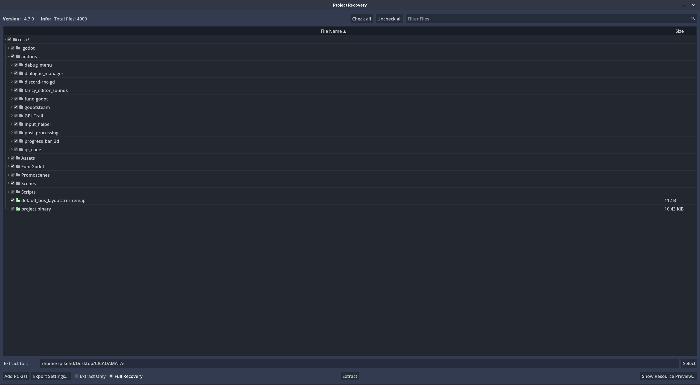
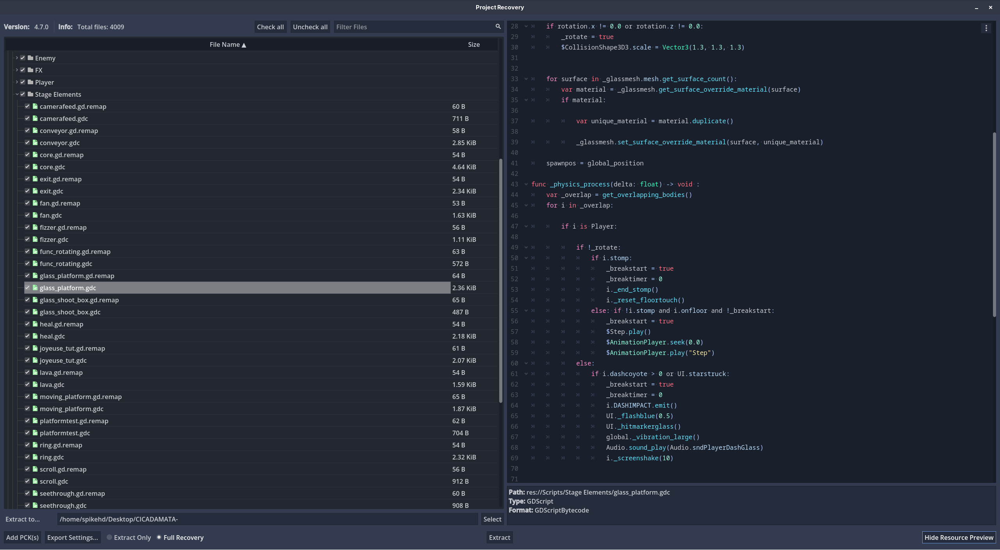
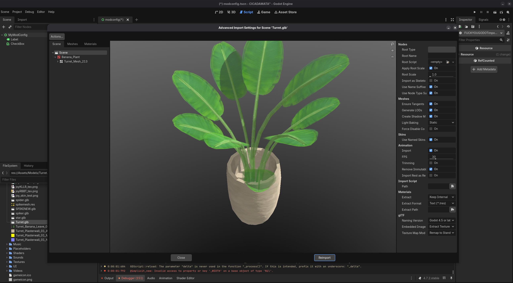
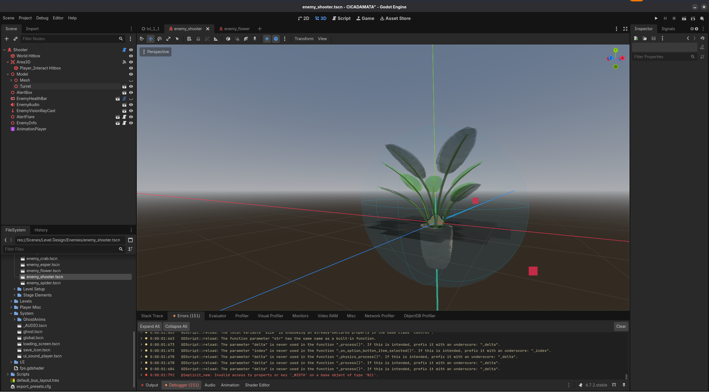
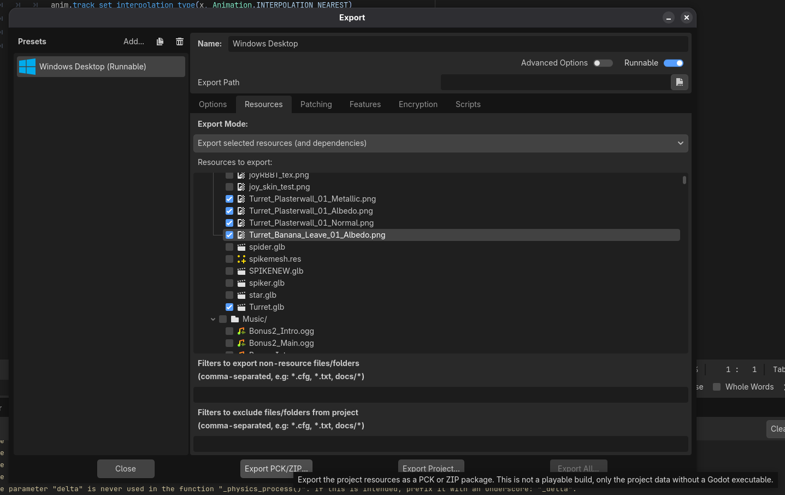
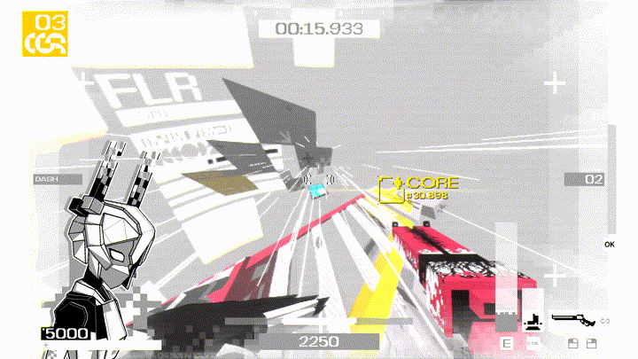

> **IMPORTANT:** This post will inevitably go out of date as GDPatch gets updates. Always refer to the [latest documentation](https://gdpatch.dev/)!

> For an example of a real, useful mod, take a look at [cicadamata-unlock-all](https://github.com/SpikeHD/cicadamata-unlock-all)

[GDPatch](https://gdpatch.dev) is a powerful Godot modding tool that allows for... well, modding Godot games. It's pretty new, and while the official docs
are pretty good, I wanted to create this post to outline some of the basic capabilities on offer as there isn't much out there yet.

To be clear: I am no modding expert, I just happened to pick this up while poking around at [CICADAMATA"](https://store.steampowered.com/app/3817250/CICADAMATA/), which
is the game I will be using to demonstrate.

# Installation

This post assumes you have already [installed GDPatch](https://gdpatch.dev/using/install/) and run the game once. Also, you should - at the very least - set up
`GDPatch/mods/your_mod/gdpatch_mod.toml` by following the [Getting Started](https://gdpatch.dev/modding/getting-started/) guide.

# Script Patching

One of the most basic forms of modifying a game is **patching it's code**. This means that we can modify the existing scripts in the game and change them to do something
else! In CICADAMATA", there are glass platforms that break when shot or when the player steps on them:


How annoying! Let's get rid of that, shall we?

First, you are going to want to use a reverse-engineering tool unpack the game. Here I'll be using [GDRETools](https://github.com/GDRETools/gdsdecomp). After clicking
"Project Recovery" and navigating to the game's `.exe` file, we see the following:



Perfect! No weird custom encryption here. Let's dig in and find our glass platform:



Nice! Now, we are first going to use [GDPatch's `patcher.lua` API](https://gdpatch.dev/modding/patcher/). By creating a file called `patcher.lua` we can swap, change, or
remove whatever code we want! In the glass platform's `_physics_process`, why don't we just nullify the logic entirely?

```lua
-- GDPatch/mods/my_mod/patcher.lua
GDPatch.patch_script_as_text("Scripts/Stage Elements/glass_platform.gdc", function(ctx, src)
  -- Return the new script, which is basically just
  -- the initial script, but with _physics_process
  -- set to now do nothing!
  return src:gsub(
      "(func _physics_process.-\n)" .. -- function declaration
      "(.-)" ..                        -- function body
      "(\nfunc )",                     -- next function
      "%1\tpass%3"
  )
end)
```

That seems to work great! If you're having trouble, check `GDPatch/output.log`, it'll probably let you know what's failing!


Well, this is nice and all, but I'd like to make it optional. Let's first specify the config option in our manifest:

```toml
# GDPatch/mods/my_mod/gdpatch_mod.toml
id = "my_mod"

[config.options.invincible_glass]
name = "Invincible Glass"
description = "Enable to ensure glass never breaks!"
hidden = false

default = true
type= "boolean"
```

Let's have the script handle this case too:

```lua
-- GDPatch/mods/my_mod/patcher.lua
local invincible_glass = GDPatch.get_config_option(nil, "options", "invincible_glass")

if invincible_glass then
  GDPatch.patch_script_as_text("Scripts/Stage Elements/glass_platform.gdc", function(ctx, src)
    return src:gsub(
        "(func _physics_process.-\n)" .. -- function declaration
        "(.-)" ..                         -- function body
        "(\nfunc )",                      -- next function
        "%1\tpass%3"
    )
  end)
end
```

Now relaunch and close the game. You should now see `GDPatch/configs/my_mod.toml` contains something like the following:

```toml
[options]
## Enable to ensure glass never breaks!
invincible_glass = true
```

Try disabling it, relaunching the game, and testing it! Or, if you're feeling crazy, try using the methods below to create an in-game configuration menu,
or even crazier, add the configuration option to the game's menu!

# PCK/Data Loading and Asset Replacement

Let's try swapping a model. I'd like the "SHOOTER" enemy to feel a bit more inviting, so I'll be swapping it's model to
[this plant I found](https://github.com/ToxSam/cc0-models-Polygonal-Mind/blob/main/projects/avatar-show/Banana_Plant.glb).

First we need to decompile the game, so within GDRETools, click "Extract" and extract the game somewhere. Then, open Godot and
click "Import". Navigate to the extracted game, and it should open! Once it's open, let's import the new model by drag-and-dropping it in.


<sup>*Here I have renamed the model to "Turret.glb", but you don't have to do that, since we will also be modifying the enemy scene*</sup>

Next, we need to change the scene of the enemy itself. Here I just hide the old mesh and attach our new one.



Now, we need to export ONLY our assets (those being the new model files, and the `enemy_shooter.tscn` since we've modified it).



> **IMPORTANT:** Be careful exactly what assets you are outputting and bundling with your mod. I'm no lawyer, but redistribution of game assets is generally
not allowed by any game publisher, and it may also cause issues with other mods (or your mod, should the game ever update). Ensure your PCK file only contains
exactly what you need. Refer to the [documentation](https://gdpatch.dev/modding/getting-started/#godot-re-tools) for more details.

Finally, put the exported `data.pck` file in the root folder of your mod, and it should load!



Wow! Looks ~~like shit~~ really good!

# Conclusion

This is only the tip of the iceberg. Looking at the GDPatch documentation, it might *feel* like it isn't super extensive, but that's because it acts
more as an enabler. Being able to load ANY scene or script on the fly means you are basically using Godot as your mod creator, which I think is
extremely powerful.

Go make something cool! Or if you want to see GDPatch do something new, [contribute to it on GitHub](github.com/GDPatch/GDPatch)!
