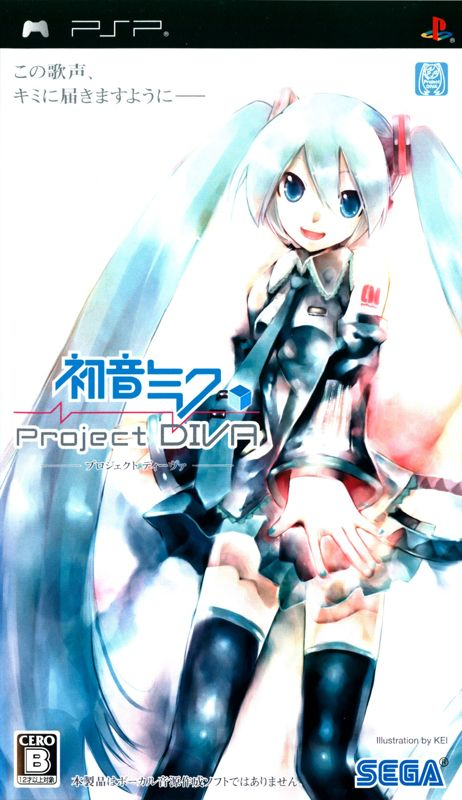
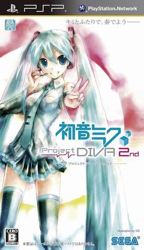
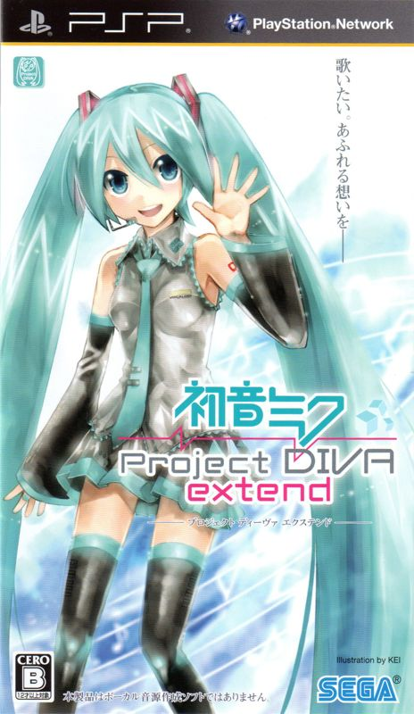
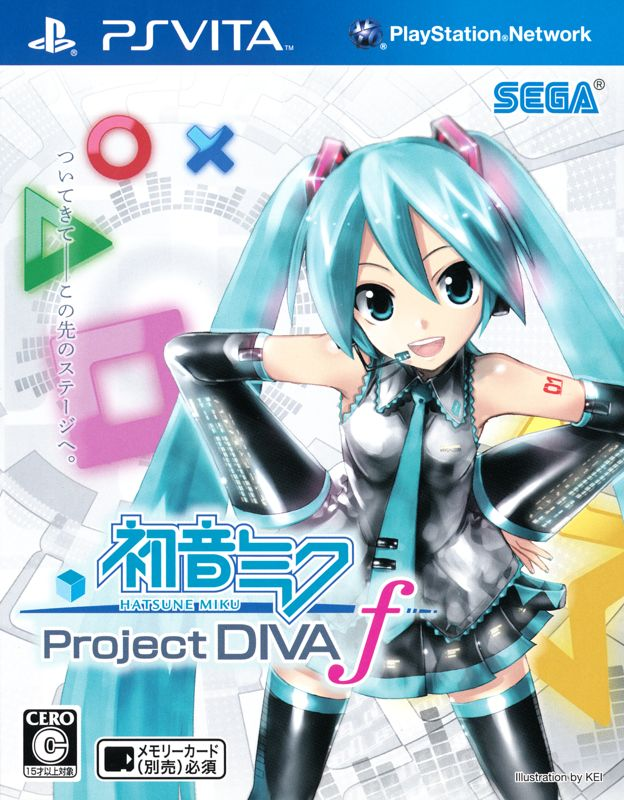
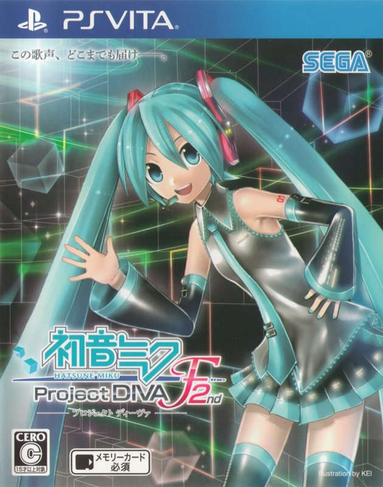
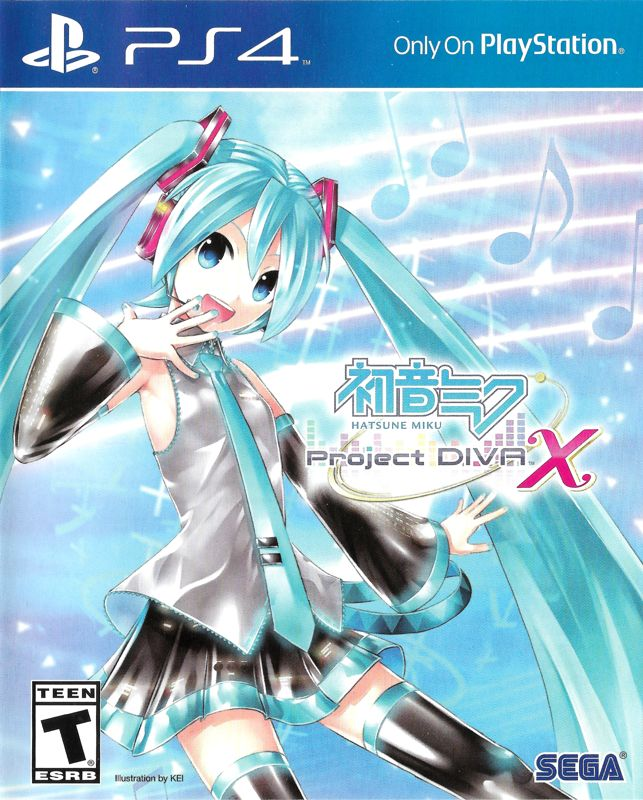
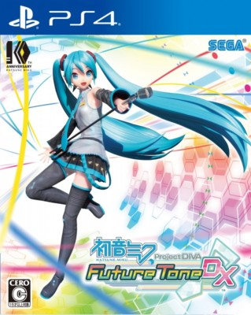
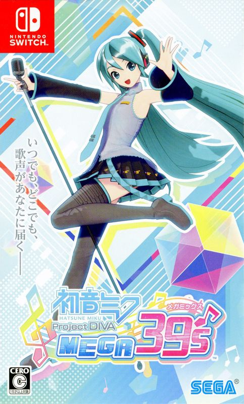

As a programmer and video game fan, it is divine prospect that I *must* have an unfortunate obsession over something that normal people don't care about. Turns out
that it's rhythm games, and my current favorite archetype is *Project DIVA-style* games (my favorite being [Project Heartbeat](https://store.steampowered.com/app/1216230/Project_Heartbeat/)).

I also have a habit of not finishing things I start, so as a challenge to myself I wanted to beat every single mainline *Hatsune Miku: Project DIVA* game released (with some minor exceptions).
Alongside each game will also be a short barely-a-review review, and an insight into my dark twisted mind as I descend further into madness.

# The Rules

1. As someone who has played enough of these style games to be good at them, it wouldn't feel right to just play the normal difficulty of each song and move on. Therefore,
**"beating the game" in this context means beating every song on Extreme difficulty**.

2. I will not be using cheats to get around playing the normal and hard variants of each song in order to unlock Extreme.

3. I will be skipping games that were re-released with the same-but-more content. **HOWEVER**, if there is content missing in the re-release that is present in the original, I will still play the original for the
missing content.

4. TODO I haven't decided if I will play all of the DLC yet lol

# The Games

## Hatsune Miku: Project DIVA

  

    
    Source: Mobygames
  

  <table class="w-2/3 my-2! ml-2">
    <thead>
      <tr>
        <th colspan="2">Overview</th>
      </tr>
    </thead>
    <tbody>
      <tr>
        <td>Release Year</td>
        <td>2009</td>
      </tr>
      <tr>
        <td>Played on</td>
        <td>Anbernic RG34XXSP (via PPSSPP)</td>
      </tr>
      <tr>
        <td>Notable modifications</td>
        <td>
          <a href="https://divafanproject.blogspot.com/2020/06/english-patch-project-diva.html">English patch</a>
        </td>
      </tr>
    </tbody>
  </table>

Haven't beat this one yet

## Hatsune Miku: Project DIVA 2nd

  

    
    Source: Wikipedia
  

  <table class="w-2/3 my-2! ml-2">
    <thead>
      <tr>
        <th colspan="2">Overview</th>
      </tr>
    </thead>
    <tbody>
      <tr>
        <td>Release Year</td>
        <td>2010</td>
      </tr>
      <tr>
        <td>Played on</td>
        <td>Anbernic RG34XXSP (via PPSSPP)</td>
      </tr>
      <tr>
        <td>Notable modifications</td>
        <td>
          <a href="https://wyrdgirn.blogspot.com/2020/01/english-patch-for-project-diva-2nd.html">English patch</a>
        </td>
      </tr>
    </tbody>
  </table>

Haven't beat this one yet

## Hatsune Miku: Project DIVA Extend

  

    
    Source: Mobygames
  

  <table class="w-2/3 my-2! ml-2">
    <thead>
      <tr>
        <th colspan="2">Overview</th>
      </tr>
    </thead>
    <tbody>
      <tr>
        <td>Release Year</td>
        <td>2011</td>
      </tr>
      <tr>
        <td>Played on</td>
        <td>Anbernic RG34XXSP (via PPSSPP)</td>
      </tr>
      <tr>
        <td>Notable modifications</td>
        <td>
          <a href="https://divafanproject.blogspot.com/2020/02/english-patch--project-diva-extend.html">English patch</a>
        </td>
      </tr>
    </tbody>
  </table>

Haven't beat this one yet

## Hatsune Miku: Project DIVA F

  

    
    Source: Mobygames
  

  <table class="w-2/3 my-2! ml-2">
    <thead>
      <tr>
        <th colspan="2">Overview</th>
      </tr>
    </thead>
    <tbody>
      <tr>
        <td>Release Year</td>
        <td>2012</td>
      </tr>
      <tr>
        <td>Played on</td>
        <td>Playstation Vita</td>
      </tr>
      <tr>
        <td>Notable modifications</td>
        <td>
          None
        </td>
      </tr>
    </tbody>
  </table>

Haven't beat this one yet

## Hatsune Miku: Project DIVA F2nd

  

    
    Source: Mobygames
  

  <table class="w-2/3 my-2! ml-2">
    <thead>
      <tr>
        <th colspan="2">Overview</th>
      </tr>
    </thead>
    <tbody>
      <tr>
        <td>Release Year</td>
        <td>2014</td>
      </tr>
      <tr>
        <td>Played on</td>
        <td>Playstation Vita</td>
      </tr>
      <tr>
        <td>Notable modifications</td>
        <td>
          None
        </td>
      </tr>
    </tbody>
  </table>

Haven't beat this one yet

## Hatsune Miku: Project DIVA X

  

    
    Source: Mobygames
  

  <table class="w-2/3 my-2! ml-2">
    <thead>
      <tr>
        <th colspan="2">Overview</th>
      </tr>
    </thead>
    <tbody>
      <tr>
        <td>Release Year</td>
        <td>2016</td>
      </tr>
      <tr>
        <td>Played on</td>
        <td>Dunno yet</td>
      </tr>
      <tr>
        <td>Notable modifications</td>
        <td>
          None
        </td>
      </tr>
    </tbody>
  </table>

Haven't beat this one yet

## Hatsune Miku: Project DIVA Future Tone DX

  

    
    Source: <a href="https://www.ebay.ca/itm/185326046322">eBay</a> (I couldn't find a better source anywhere else???)
  

  <table class="w-2/3 my-2! ml-2">
    <thead>
      <tr>
        <th colspan="2">Overview</th>
      </tr>
    </thead>
    <tbody>
      <tr>
        <td>Release Year</td>
        <td>2017</td>
      </tr>
      <tr>
        <td>Played on</td>
        <td>Dunno yet</td>
      </tr>
      <tr>
        <td>Notable modifications</td>
        <td>
          None
        </td>
      </tr>
    </tbody>
  </table>

This one is a port of the arcade game, and I don't have any of those near me (nor am I driving out just to hog the machine). I think this one is technically two songs? But it also
has 14 songs not found in the arcade release so I think that makes up for it. I am also skipping the non-DX release as it's also just the same thing with less songs (this one has Ghost Rule!).

## Hatsune Miku: Project DIVA MegaMix+

  

    
    Source: Mobygames
  

  <table class="w-2/3 my-2! ml-2">
    <thead>
      <tr>
        <th colspan="2">Overview</th>
      </tr>
    </thead>
    <tbody>
      <tr>
        <td>Release Year</td>
        <td>2022</td>
      </tr>
      <tr>
        <td>Played on</td>
        <td>PC (Steam)</td>
      </tr>
      <tr>
        <td>Notable modifications</td>
        <td>
          None
        </td>
      </tr>
    </tbody>
  </table>

I'm skipping MegaMix (non-plus) because they are the same games. This is also the final *Project DIVA* game before [Colorful Stage!](https://en.wikipedia.org/wiki/Hatsune_Miku:_Colorful_Stage!)
took everything good and pure from us[^1]... and then gave us [a movie](https://en.wikipedia.org/wiki/Colorful_Stage!_The_Movie:_A_Miku_Who_Can%27t_Sing)?

[^1]: i actually really enjoy colorful stage, i dont interact with the gacha mechanics at all i just play the songs
