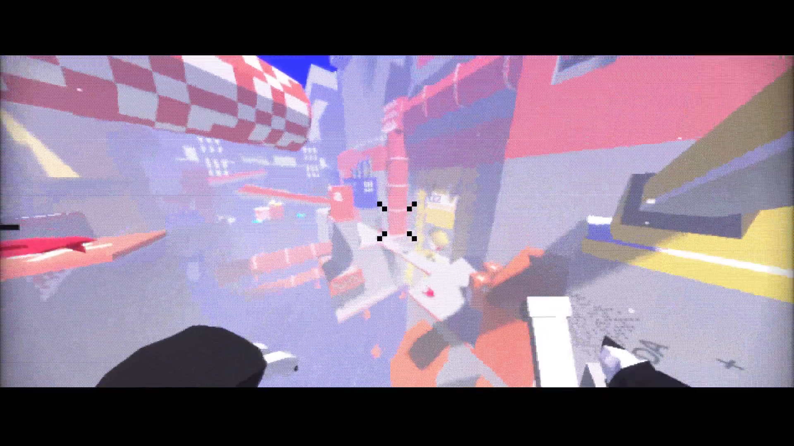
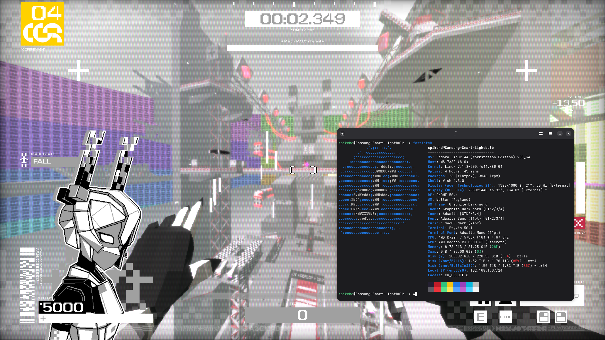
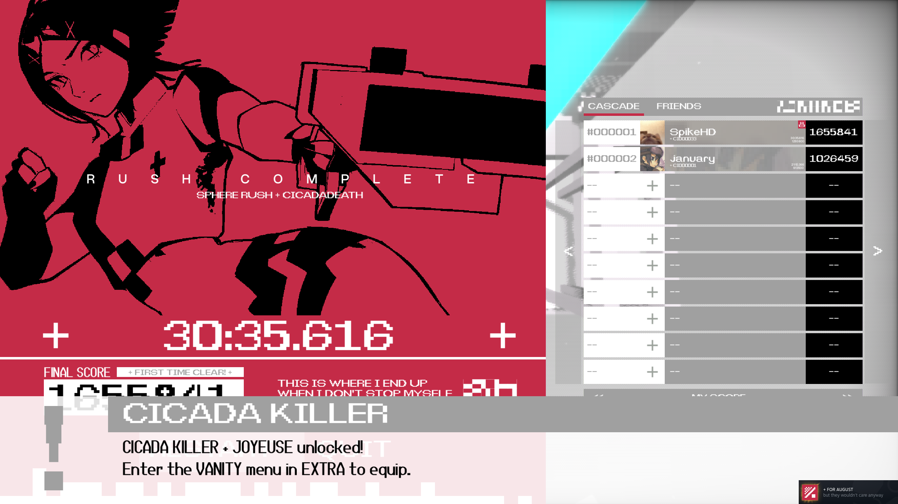

Finally, knowing cool people has paid off, as I was given access to [CICADAMATA"](https://store.steampowered.com/app/3817250/CICADAMATA/)
more than a week early by a good friend whose been working on it. And now you have to hear about it because I like it.

The following content is insanely, unbelievably biased.

## What is CICADAMATA"?

(No, the quotation mark isn't a typo)

CICADAMATA", by [✿ flowergarden](https://store.steampowered.com/developer/flowergarden), is one of those speedrunny movement shooters where you're exposed to some
very light preamble to teach you mechanics and give you a sense
of the world, before throwing you into the deep dark chasm (or in this case, a brightly colored void) to optimize those mechanics in a collection of levels, competing
on a leaderboard against your friends who do not care that you just beat their score. Or maybe they do. Mine don't.

You are given a dash, jump (plus multiple air-jumps! No wonder your codename is "White Rabbit"), stomp, and a gun, and with these tools you will complete
"Spheres", which are basically "worlds" containing a set of levels (with the final one usually being the largest or most interesting).
Each sphere will also introduce some new mechanic or enemy, often used in future spheres. Personally, I'm a big fan of the last sphere and it's mechanic, "Starstruck",
which basically boosts your dash distance, jump height, shooting frequency, and fucks your screen up real nice. If anything I wish I got to use it more in the main game, though
there is an additional Sphere rush mode you can unlock that uses it heavily, and that filled the gap for me.

When looking up this game, there is a 1000% chance you see comparisons to the likes of ULTRAKILL and Neon White. While calling it "ULTRAKILL with Marathon's aesthetics"
feels a slight bit reductive, there are definitely parallels and I think fans of those games will very much like this one. One difference you will find is that, while
something like ULTRAKILL's level design is (generally) built to facilitate the goal of killing, CICADAMATA"s level design is flipped, where enemies exist to
facilitate the goal of moving.

## Atmosphere and Design

As a web developer I am a bit of a sucker for cool design, and CICADAMATA" oozes it. I mean, just look at the intro for the Demo Disc (**flashing lights warning!**
It's also kinda loud):

<video src="./cicadaintro2.mp4" controls>
</video>

There are so many little details throughout every visual element of the game. The flickering of text, the glitchy way UI blocks come in and out, all the filtering, *mwah* 🤌
I love it.

In gameplay your screen is slathered with post-processing effects, which some people may find off-putting. There are plenty of settings to change those, so don't let it stop you,
but know that the game starts off a bit flashy.

The UI is also very well designed, I personally really like the jump counter/overheat meter thing. I don't actually
pay attention to it (you get accustomed to the timings pretty quick), but I like that it's there. It is a bit busy, and there are plenty of elements that *probably* don't need to
be there (like the entire upper half of your character hanging out on the left side), but it's definitely intentional and, in my opinion, fits very well into the game as
a whole.

Levels in CICADAMATA" are generally low-poly, but certainly not in the Unity asset-flip kind of way. Levels are blocky and "simple" in a way that makes them
very visually clear, but they also contain plenty of color, particles, and contain countless unique landmarks that make the levels genuinely fun
to explore and figure out.

## Gameplay

With your aforementioned movement tools of trade, you must navigate various levels to collect 4 "cores". To accumulate score, you must not only
complete the level quickly, but also neutralize as many enemies as possible (ideally, all of them).

To do this, you can dash into enemies, stomp them, or shoot them with your weird fucked up sentient shotgun, JOYEUSE. JOYEUSE has two modes of fire,
the regular shotgun which shoots four spreading projectiles, and an alt-fire railgun that instantly kills whatever you hit.

There's a lot of creativity to be had with completing the levels. Where similar games are often guiding the player through a certain
route, with potential for "skips" and shortcuts, CICADAMATA" offers a slightly more open-ended approach to a lot of the level design (with it's own skips
and shortcuts, of course). Don't get me wrong, some levels definitely have "intended" paths, but there are others that give free reign over the loop you decide to take,
and I found it super fun trying to piece together the route on my own terms once I understood that it was intended for me to do so.

From [CICADAMATA" + release date trailer](https://www.youtube.com/watch?v=rSNVqNGrWA0)

One thing I think will trip some people up, is that your score is predicated more on killing enemies than it is your time. Don't get me wrong, your time 
*definitely does matter*, but if you aren't killing all (or most) enemies, you can assume your score will be lower than someone else who took slightly more
time but killed more than you[^1]. At first I thought that this would be at odds with the whole "beat game fast" goal of the level design, but what I learned from playing
is that the levels are generally designed to help you accomplish BOTH objectives, so long as you know what you're doing. This is actually where being able to
solve the puzzle of each level comes into play the most, especially the more open ones.

Further, your score can be increased by killing enemies during "Zone Time". While zone time is active, your points are doubled until it runs out, meaning optimizing zone time
effectively can be an important differentiator when gunning for high scores. Zone time is active once you fill your "Zone Bar", which is done by gaining score in quick
succession.

On top of containing 6 of spheres (totaling 18 main levels), the game also includes a few bonus levels. The second one, "Mist", is my personal favorite. It also has a couple sphere-rush modes for
you freaks out there[^2].

## Music and Sound Design

I'm no music nerd, but I think the music is really good. It's difficult to go wrong with "DnB/jungle/etc. etc. insert niche subgenre here" in a game like this,
and the gameplay compliments it really well.

The sound effects, too, are incredibly fitting. I feel like if I could bite the sounds they would crunch and it would hurt my mouth really bad. But in like, a good way.

[You can buy Vol. 1 of the OST on Bandcamp!](https://stillcrisp.bandcamp.com/album/cicadamata-original-sound-collection-vol-i-tear-flesh-from-bone)

## Story, Secrets, etc.

The story itself is purposefully vague and strange, and it's hidden throughout the game as opposed to holding your hand through cutscenes and dialogue. You will likely never find out why
they put the " there, but as you progress you will piece together that there is some semblance of... events... happening. Probably.

At the very least, you will learn about some of the other characters involved in the world of CICADAMATA". While playing, you might notice the other callsigns listed within your
dropship. These names often come up in the hidden logs throughout the game, describing the association between cores and spheres, the different behaviours of the other MATA"s,
the fall of an organization, CREVASSE, due to an infection named RED VEIL,
and a love(?) story between someone (something?) named DEMETER and AEGIS, the omnipresent voice that speaks to you throughout the game. AEGIS is written in a really expressive way, like
different shards of personality are being triggered by certain phrasing/subject matter mid-entry:

> I wish I had more [?rule/#autonomy] over the facility.

> CICADAS receive my [,voice/!orders].

> [...] does not seek [DEATH!DEATH!DEATH!]

A quick Google for "JOYEUSE" will teach you that this was also the name of one of Charlemagne's swords, with "DEMETER" and "DIONYSUS" - other weapons mentioned in text - being greek gods.
There's probably some literary connection that can be made here, but unfortunately I didn't do very well in highschool English, so alas you will have to watch a YouTube video essay
or something instead.

I don't want to spoil all of the little tidbits of information hidden throughout the game, so just know that there is much more dialogue than you think there is (including on the dropship,
and talking to your own gun), and it's all pretty engaging. Unlock them, read them online, or watch a YouTube video, I don't care, but expose yourself to the story of the game somehow,
because I think it's neat.

There are also a handful of easter eggs if you decide to go looking for them. There's a certain pineapple under the sea that you can find with a bit of sleuthing, for example...

## Performance and Compatibility

I'll keep this short because you don't care: the game runs great on my Fedora 44 machine sporting an RX 6800 XT/Ryzen 7 5700X, which I understand is not indicative of the
average PC (though it DOES mean that it *should be* Steam Deck compatible).

In cooler news, I also tested the game running on my [AYN Odin 2 Mini](https://droix.net/product/ayn-odin-2-mini-pro/), an ARM device running ROCKNIX, and it was mostly playable!
Since that's running under *multiple* translation layers, I'm quite certain the game should run almost anywhere barring some weird, specific compatibility issue.

## Conclusion

CICADAMATA" is extremely impressive for having been made in about a year. Oh yeah, did I mention it was completed in about a year? Crazy.

CICADAMATA" is the first game in a long time to make me want to just keep playing more. I highly reccommend giving it a try, because
I personally am already hoping to see some sort of sequel, or another game in the same universe, or... well, frankly I just think I'd love to play another game from ✿ flowergarden.

  Obligations no longer bind you. This is who you are now.
  Tear flesh from bone.
  

    
    
  

  

    P.S: Not to brag, but I used to have the #1 CICADADEATH score
  

  

[^1]: there are even "scoremaxxing" techniques you can implement. shooting a turret from far away to get "hit" score, then stomping it three times to kill, will net you more score
than just railgunning or just stomping it, for example
[^2]: it's me, i'm freaks
