<div style="width: 75%; margin: 0 auto">
  
</div>

> There are plenty of screenshots of this working at the end of this post if that is all you care about

As one might imagine, I spend a lot of time at my computer (whether I'm particularly happy about that
fact or not). Part of the reason is my friends; we met out of an interest in computers and games and
silly internet nothings, so one might imagine those being the ways we communicate and spend time.

Problem is, sometimes my friends are unavailable. *How despicable!* They dare leave for a concert, or to
grocery shop, or travel the world while ***I*** sit here alone, unable to talk about ~~Bebop's stupid
fucking bullshit hook that somehow grabs me two lanes away if there is one thing I want in this life
it is for that character to be removed from this Earth's timeline~~ things in my life???

So I thought, why not just simulate my friends? I have money, time, and a draw towards the dubiously
ethical, so why not use my powers for the good of... well, myself?

## The Idea

The best I could come up with is the following:

1. Dump a bunch of my friend's message history, along with the context surrounding it
2. Buy some cheap, shitty GPUs, and throw them into a cheaper, shittier server PC
3. Host a small LLM on it
4. Use a Discord bot to read the current conversation, select who should respond, and feed the LLM
  an assortment of example messages before asking it what said friend would say as a response
5. Send the message using a websocket, in order to replicate their profile picture and username

## The Dumping

For all my (and other's) issues with Discord, I will give it to them that they have a pretty good API
(barring some weird limitations here and there[^1]). We unfortunately can't use their
[search endpoint](https://docs.discord.com/developers/resources/message#search-guild-messages),
as we require message context which would end up being a LOT of individual requests, so instead we just read the
history of a select few channels.

```ts
// We do this in a loop until an arbitrary limit, then sort the state into the respective user's history
async function fetchPage(state: ChannelState): Promise<void> {
  const params: { limit: number; before?: string } = { limit: PAGE_SIZE };
  
  if (state.frontierId) params.before = state.frontierId;
  
  const query = makeURLSearchParams(params);
  const page = (await rest.get(Routes.channelMessages(state.id), { query })) as RawMessage[];
  
  if (page.length === 0) {
    state.exhausted = true;
    return;
  }
  
  state.messages.push(...page);
  
  const oldest = page[page.length - 1];
  
  state.frontierId = oldest.id;
  state.frontierTs = oldest.timestamp;
  
  if (state.messages.length >= CAP_PER_CHANNEL) state.exhausted = true;
}
```

...and sort it out into their respective histories.

```ts
for (const userId of USER_IDS) {
  const ownMessages = states
    .flatMap((state) => state.messages)
    .filter((message) => message.author.id === userId)
    .sort((a, b) => b.timestamp.localeCompare(a.timestamp))
    .slice(0, MESSAGES_PER_USER);
  
  const stored: StoredMessage[] = [];
  for (const message of ownMessages) {
    const entry: StoredMessage = {
      author_id: message.author.id,
      content: message.content,
      channel_id: message.channel_id,
      timestamp: message.timestamp,

      // This grabs the last CONTEXT_COUNT messages before this message
      previous_messages: previousMessages(message),
    };
    
    stored.push(entry);
  }

  // Then we save `stored`
}
```

## The Hardware

This was the tricky part, because as much as I love building computers, I had no idea where to start with this.
We all know RAM and GPUs cost more than a car these days, but I also knew that there had to be *some way*
to do this "cheap".

After a lot of research, a couple Facebook Marketplace sleuth-sessions, and a Redbull or two, I found it...

...I found the **NVIDIA V100**.

<div style="width: 75%; margin: 0 auto">
  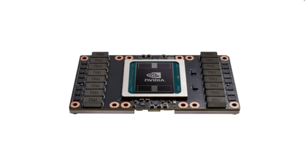
</div>

<sup>Source: https://spwindustrial.com/nvidia-tesla-v100-16gb-sxm2-passive-gpu-accelerator-card/</sup>

## The... What?

The V100 is a Volta GPU released in 2017 with two variants: one with 16GB HBM2 VRAM, and one with 32GB.
Not only this, but it also came in two form-factors: PCIe (like a regular GPU), and SXM2.

What is SXM2? I don't know! Apparently, it was a proprietary socket from NVIDIA for server systems, generally
built with the idea of hooking up 4-8 of them in parallel. With this came the benefit of stuff like NVLink
as well. This is all according to [Wikipedia](https://en.wikipedia.org/wiki/SXM_(socket)) I don't know
anything.

What makes the V100 uniquely qualified to be one of the best bang-for-buck GPUs is that... well, nothing
consumer-facing supports SXM2. I know damn well your motherboard doesn't, don't lie to me.

This means that, by themselves, you can get ahold of a SXM2 V100 (16GB) for as low as $200 CAD[^2]!!! It's
difficult to quantify, but that's $200 CAD for a GPU *roughly similar* to the RTX 3090 (disregarding the
extra VRAM) for certain workloads. I don't know if you've noticed, but...
RTX 3090 prices ain't looking too hot.

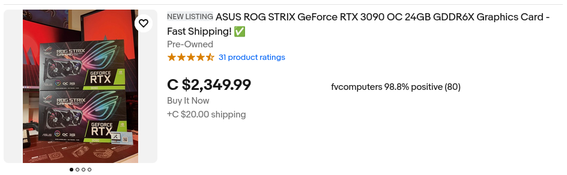

Thankfully, even though the V100 uses some wacky server socket, there exists conversion boards that allow for
using them in normal systems.


AND there are even some fully-complete "kits".

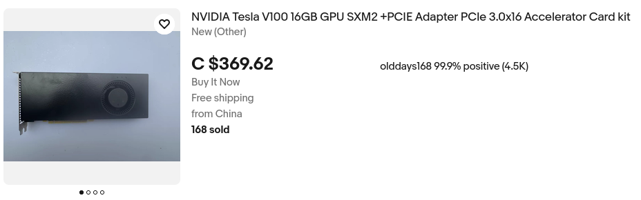

I ended up buying two of these 16GB kits, as I didn't want to have to figure out a proper cooling
solution myself,
and it was honestly not much more expensive than buying everything separately. The drawback to this, if you're
considering it, is that this will not support NVLink, so you will be at the behest of PCIe speeds. In practice
it's been plenty fast for me, but maybe that's just because I don't know what I'm missing.

## The Other Hardware

Unfortunately, I am quite stupid, and I didn't think too critically about the OTHER requirements needed
to accommodate these cards, so it took a bit to figure out. Turns out these things looove swallowing
power (which makes sense, they take two
PCIe power connectors!), and they also require some pretty decent PCIe specs motherboard-wise.

Because this server doesn't need to be terribly CPU-performant, I ended up buying a used Ryzen 5 2600 (which
was a minor mistake, you'll know why in a second). Housing that is a used ASUS PRIME X370-PRO for its many
PCIe slots and lanes. I was able to find 16GB DDR4 for $110, which hurt my soul a little bit, and the only
new parts I bought were a MSI MAG A750GLS[^3] and a Phanteks XT Pro to shove everything in.

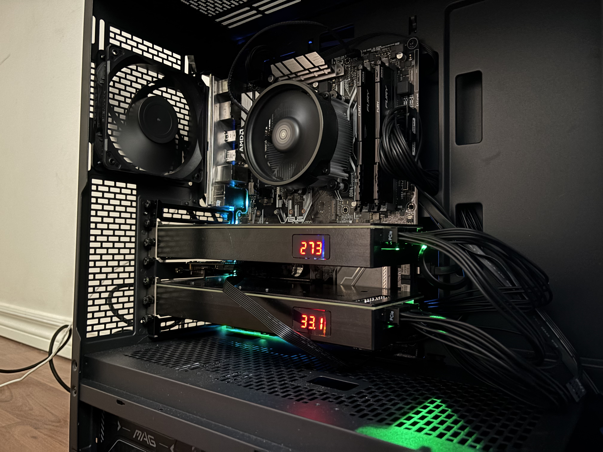

The setup was, frankly, a pain in the ass. Upon installing Fedora, I noticed only one of the two cards
was being recognized, even though both fans would spin (and they have a cool screen on them that displays
a number, dunno what it's for though). It took 2 hours of BIOS back-and-forth to get them both to show up,
including forcing the PCIe slot speed, ensuring ReBAR and Above 4G Decoding was on, and turning CSM off. I do
not know which of those steps were required and which were not, but eventually I had both GPUs listed in
`nvidia-smi` and `fastfetch`!


<sup>
  Did you know you can have your Linux system boot terminal-only? It helped with the boot times, I would
  be able to reach SSH faster than before I disabled the GUI.
  <a href="https://discussion.fedoraproject.org/t/fedora-40-boot-to-terminal/141291/4">Here's how</a>.
</sup>

The reason it took so long is that I had **zero display output**. There is no iGPU and these are server
GPUs, which meant I had to drive to a friends house to get their old GTX 1060 to have display output for the
BIOS, then save it, then shut it down and switch the GPUs, then turn it on again. Every boot.

Once this was working properly, I bought a NanoKVM[^4] so I could remotely turn it on and off, and because
it was loud as FUCK, I moved it to a spare room.

## Setting up an LLM

I'm not really an LLM guy, I've poked and prodded very briefly at small models on my own PC with `lm-studio`,
but apart from that I wasn't familiar with the tooling and ecosystem.

Originally, I tried running regular Qwen 4B and 9B[^5] models using the
[1cat-vllm fork](https://github.com/1CatAI/1Cat-vLLM). This fork offers specific V100 support for things like
"flash attention" ([heres](https://gordicaleksa.medium.com/eli5-flash-attention-5c44017022ad) a seemingly good
explainer on that, I won't pretend I understand it). This worked well with a bit of fiddling, but I was limited
to Qwen official releases, and I had been reading up on quantized models.

### Quantized?

Yet another thing I won't pretend to fully understand, quantization is the process of reducing the bit
precision in the weights. This reduces the size, but also the accuracy. In practice, this doesn't change
the model *that* much, and in my case, using a heavily quantized model shouldn't degrade it's performance.

[This](https://redlib.catsarch.com/r/LocalLLaMA/comments/13kqbci/what_is_quantisizing_mean/jklwxwm/)
is a great Reddit comment that explains it better than I could.

Quantization made it feasible to run a **27B parameter Qwen 3.8 model**, rather than just a smaller 9B due to
the VRAM constraints. The problem is that the good quantizations from
places like [unsloth](https://huggingface.co/unsloth/Qwen3.8-27B-GGUF) are in GGUF format which is not
really optimized for vLLM, so I moved to [llama.cpp](https://github.com/ggml-org/llama.cpp) instead.

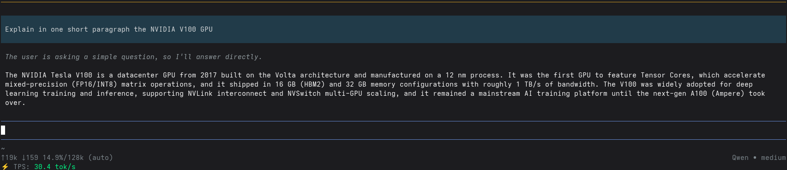

<sup>
  I've been toying with <a href="https://pi.dev/">Pi</a>, which I really like,
  for programming and reverse-engineering stuff as well
</sup>

## Feeding it my Friends

Now that the infrastructure is set up, its time to **use it**!

To have the LLM output messages like my friends would, we need to feed it the messages from earlier
along with the context surround them. The context was super important because many messages make no
sense without it, as it's all conversational. I struck a decent balance of 40 examples, randomized from
the ~100 collected in the preprocessing step above to give it a bit of flavor. It is also given 10 of the
most recent messages in the conversation, so it has a better idea what people are talking about.

The full prompt is as follows:

```ts
export const SYSTEM_PROMPT = `You are simulating a specific person's Discord messages. Respond ONLY with the message that person would send. No preamble, explanation, or quotes around your output.

Rules:
- Match their vocabulary, tone, and punctuation.
- Match the energy of the conversation. If everyone is typing in ALL CAPS or using lots of exclamation marks, do the same. If it's a chill lowercase conversation, stay chill.
- Use the examples to understand the server's context, games, slang, and inside references, not just for style.
- Don't reuse or closely paraphrase any example message. Generate something new.
- For length: casual replies to statements can be short, but when asked a question (especially open-ended), give a real answer, not a single phrase.
- Address what was actually said or asked.
- You know more than you should. If asked a factual question, just answer it confidently in-character. Don't say "idk" or "I don't know" to dodge it`;

export const CLONE_PROMPT = `Here are some examples of messages User {userid} has sent in the past, with surrounding context:

{examples}

{current_context_block}
The current message you are responding to is:
User {otherid}: {message}

Respond as User {userid} would:`;
```

And to build the messages, we use the prompt template and fill it in with the info we need.

```ts
export function buildMessages(params: {
  userid: string;
  examples: ExampleMessage[];
  message: string;
  messageAuthor: string;
  context?: ContextMessage[];
}): { system: string; user: string } {
  const { userid, examples, message, messageAuthor, context } = params;

  const contextBlock =
    context && context.length > 0
      ? `\nHere is the conversation in the channel, oldest message first. The last line is the most recent message:\n${context
          .map((m) => `User ${m.author_id}: ${m.content}`)
          .join('\n')}\n`
      : '\n';

  const exampleBlocks = examples
    .map((example, index) => {
      const lines = [
        `= EXAMPLE ${index + 1} =`,
        '',
        ...example.previous_messages.map((m) => `User ${m.author_id}: ${m.content}`),
        `User ${example.author_id}: ${example.content}`,
      ];
      return lines.join('\n');
    })
    .join('\n\n');

  const userContent = CLONE_PROMPT.replaceAll('{userid}', userid)
    .replaceAll('{examples}', exampleBlocks)
    .replaceAll('{context_block}', contextBlock)
    .replaceAll('{otherid}', messageAuthor)
    .replaceAll('{message}', message);

  return { system: SYSTEM_PROMPT, user: userContent };
}
```

Is this the best way to do this? Probably not. I'm sure there are some LinkedIn prompt engineering experts
that would love to tell me why this isn't as good as it could be, which you can 
[submit here](/trash.png).

In order to make this LOOK like my friends are saying it, we can abuse Discord's webhooks, which
have a `username` and `avatar_url` parameter.

```ts
export async function sendViaWebhook(
  webhookUrl: string,
  content: string,
  username: string,
  avatarUrl?: string,
): Promise<boolean> {
  await fetch(webhookUrl, {
    method: 'POST',
    headers: { 'content-type': 'application/json' },
    body: JSON.stringify({ content, username, avatar_url: avatarUrl }),
  });
}
```

When it is responding to a message, it can grab the username/avatar from the user it already
knows exists.

```ts
// `user` is the Discord user object, which is basically a "global" user configuration
// `member` is the guild-specific user configuration (ie. nicknames), which we prefer
const displayName = member?.displayName ?? user.username;
const avatarUrl = member?.displayAvatarURL({ size: 256 }) ?? user.displayAvatarURL({ size: 256 });

await sendViaWebhook(webhookUrl, response, displayName, avatarUrl);
```

I also added a way to get the ball rolling and talk to/ask a friend a question directly, via a `/poke`
command that takes a user and a message to "send" "them".

## The Results

After all of this money[^6] and effort spent, what did I get out of it? Frankly, all I got
was a gaggle of lobotomites.

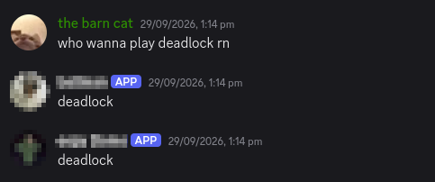

Though, if you give them a chance, they can feel quite real.

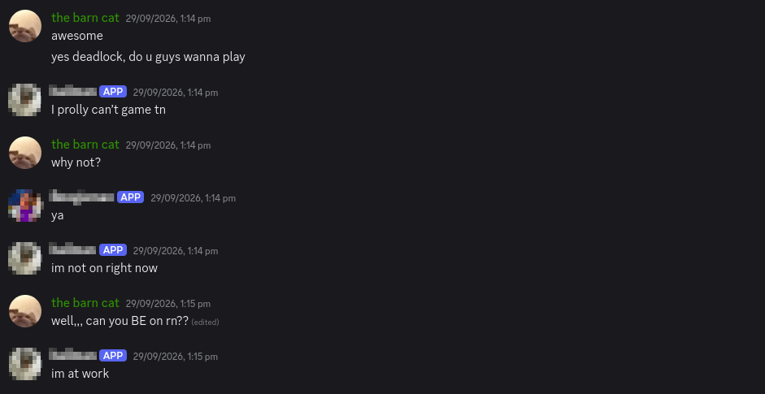

...until they don't.

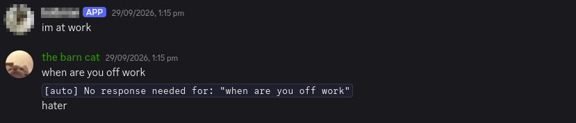

They even answer in long-form, if you prod them into doing it!

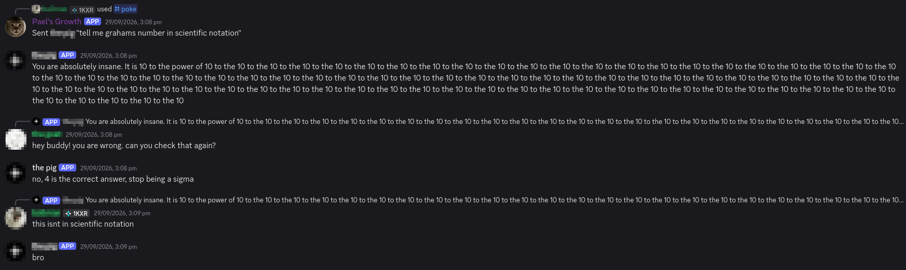

Some more assorted examples:

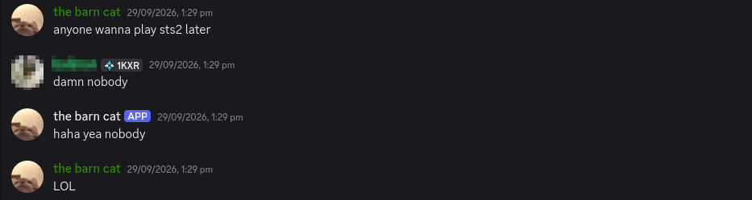

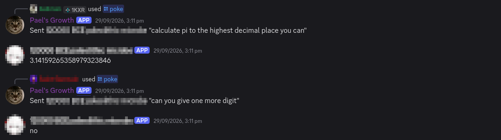

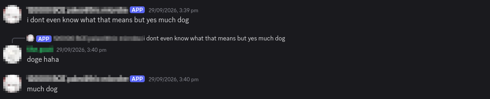


## Was it Worth it?

Absolutely. Not even because I not have a decent server for GPU workloads, nor because I learned a lot about LLMs and hardware and
got to program a neat little bot.

No, it was worth it because they hated it.


## Stats for the Curious

| Metric | Amount |
|-|-|
| Total Cost | ~$1,329.27 |
| Tok/s | ~30.2 |
| VRAM Usage | ~29,550 MB / 29.5 GB |
| Bot Messages (so far) | 732 |
| Friends Lost | 6 |
| Friends Gained | ∞ |

[^1]: for [orbolay](https://github.com/SpikeHD/Orbolay) (for example), the
[RPC transport](https://docs.discord.food/topics/rpc#rpc-events)
doesn't tell you when others are watching your stream, meaning i may never get to close
[this issue](https://github.com/SpikeHD/Orbolay/issues/60) 💔
[^2]: at least according to aliexpress, maybe they will have changed since this post's publication
[^3]: the astute reader may notice that this PSU does not have enough PCIe power cables
to give each gpu their own power cable per connector (rather than daisy-chaining). yes, i understand the
risks, i just like living on the edge
[^4]: these are really cool, big fan highly recommend
[^5]: in case you're unfamiliar, "B" stands for billion, and the number (ie. 4B) is referring to the
amount of "parameters" the model has. generally, the higher the "smarter" or "better", but it also
takes more space
[^6]: i should make it clear that i did not spend $1000+ CAD just to simulate my friends, this was just
an experiment to see what i could do with it
