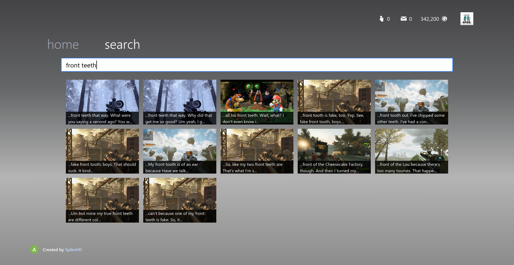

Much like any person trying to prevent silence from allowing their mind to serve them a single thought, I listen to a lot of podcasts. A favorite of mine is [The Yard](https://www.youtube.com/@TheYardPodcast),
which [someone made a "bit search" website](https://old.reddit.com/r/TheYardPodcast/comments/1b0tb5n/i_made_yardsearch_a_search_engine_for_the_yard/) for last year. I've always thought this site was super cool in functionality,
and I myself have used it before, so I wanted to recreate the concept for another favorite web-show of mine, [Message2AllFriends](https://www.youtube.com/@Message2AllFriends)[^1].

This ended up becoming [search4allmessages.online](https://search4allmessages.online/)!

# Inception

My first and only requirement is that it had to be cheap af to host. In order to prevent any costly backend requirements, my original idea was that it would download some compressed form of every transcript
and have the search occur on the client. As it turns out, that idea sucked ass:


<span class="text-sm">*This is just one request! For context, loading the ***entirety*** of the Twitter front page required just ***6MB*** of data, images and all.*</span>

As you might imagine, loading 13+ megabytes of data - without being able to use any form of cache (what if a new episode comes out?) - is slow as hell and not even viable for the relatively small number of episodes
that are currently available. What if, instead of 29 episodes, there were 290? I wasn't about to force a whole 130MB download per page load, so I had to bite the bullet and write a real backend.

# The Backend

Get your votes in now, what do you think I use for data and search? Redis? Elastic/OpenSearch? A vector database?

Nope! It needs to be cheap, remember? For this project, it's just raw data in a single file!

Well okay, I'm not just shoving a bunch of raw, unformatted SRV3 data into a single file and calling it there. When an API request is sent, I check to ensure the transcript cache is up-to-date and if it isn't (ie. a new transcript
has been downloaded since the last request), I read it, parse/transform it into a much simpler format (we're talking a roughly 70% size decrease), and then store it + some metadata with the rest of 'em.

Now that we have it in an easy-to-read format, I have the backend run through a stupidly simple loop over each episode, perform a **fuzzy search**[^2], and spit out the best results.

```ts
export async function GET(
  _req: NextRequest,
  { params }: { params: Promise<{ phrase: string }> },
) {
  const { phrase } = await params;
  const data = await getLatestTranscriptData();
  const results = []

  for (const video of data) {
    const matches = await fuzzySearchTranscriptWithContext(video.transcript, phrase);
    const { transcript: _, ...data } = video

    results.push({
      ...data,
      matches,
    });
  }

  return new Response(JSON.stringify(results), {
    headers: { "Content-Type": "application/json" },
  });
}
```

The transcript is stored in chunks rather than large blocks of text in order to preserve timestamp data. A problem that arose from this is that a search query may match a phrase or sentence that spreads over two different chunks.
Solving this was relatively easy using the previous and next chunks as a sort of "context".

```ts
for (let i = 0; i < transcript.length; i++) {
  const prev = i > 0 ? transcript[i - 1].text : "";
  const current = transcript[i].text;
  const next = i < transcript.length - 1 ? transcript[i + 1].text : "";

  // Combine the previous, current, and next texts for context
  const windowText = [prev, current, next].filter(Boolean).join(" ");

  const fuse = new Fuse([{ text: windowText }], {
    keys: ["text"],
    threshold,
    includeScore: true,
    includeMatches: true,
    ignoreDiacritics: true,
    findAllMatches: true,
  });
  
  // ...
}
```

# Wait... How Are You Even Getting Transcripts?

Originally I wanted to walk the righteous path and use the YouTube API like the rule-follower I am, but I quickly learned that the API doesn't actually expose the auto-generated transcript. This
is obviously a problem as there are no human-made subtitles for any of the episodes, at least as far as I know. The best alternative, then, was [YT-DLP](https://github.com/yt-dlp/yt-dlp). If you're in the same boat as
me, here's the command I use:

```sh
yt-dlp \
  --skip-download \
  --download-archive "/data/downloaded_videos.txt" \
  --write-subs \
  --write-auto-subs \
  --sub-lang "en.*,en" \
  --sub-format srv3 \
  --write-thumbnail \
  --write-info-json \
  --no-overwrites \
  --no-post-overwrites \
  -o "/data/%(title)s-%(id)s/%(title)s.%(ext)s" \
  "https://www.youtube.com/channel/${CHANNEL_ID}"
```

This makes the backend setup super simple: check once a day (with `cron` or whatever) if there is a new video and download the transcript if there is. In my case, this is set up in a Docker container that shares the data volume
with the frontend container, all orchestrated with Docker Compose. Simple!

# Wrapping It Together

What is a cool website without a cool design?

Because the identity of M2AF is so closely tied to late 2000s-early 2010s gaming culture (specifically on the Xbox 360), I thought it would be fitting to have the site be a recreation of the Xbox 360 dashboard!
This is done with React + Tailwind, and there isn't anything particularly interesting about the implementation, but I'm proud of how it looks:



<span class="text-sm">*["Got a homie named Tustin, he's got fuckin- uhm- and he's got molars for front teeth"](https://www.youtube.com/watch?v=nNYiq8k-gso)*</span>

Close this tab and go watch M2AF now. Some are saying they're the most cerebral minds of our generation and you don't wanna be missing out on that.

***Edit:** Just found out they [pinned the site on the subreddit](https://old.reddit.com/r/M2AF/) lol. All of a sudden I feel a sense of responsibility to keep this site up and running... uh oh...

[^1]: for the unaware, this is a reference to an old xbox 360-era callout. you'd recieve a message along the lines of *"m2af deleting people off my friends list, msg to stay"* or *"m2af hosting quickscoping lobby must have mic"*
[^2]: the library i use for the search is [fuse.js](https://www.fusejs.io/). it was the first one i tried and it worked well, though i want to move the search to rust in the future.
