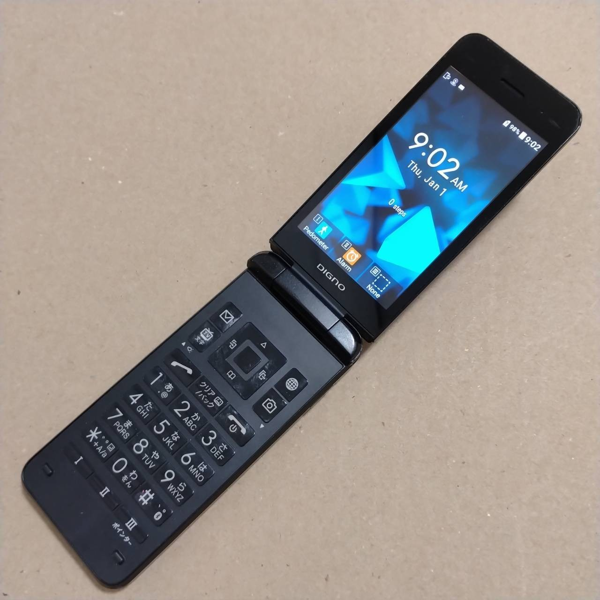

In July of 2024, I put my jailbroken iPhone 11 (with an *ever-so-slightly* cracked screen) into a drawer, and committed to using a Kyocera 902KC as my main
phone instead.

For context, this is a Kyocera 902KC:

*From [ohtas-0](https://www.ebay.ca/sch/ohtas-0/m.html?item=315132313233&rt=nc&_trksid=p4429486.m3561.l161211) on eBay*

This phone sports a **Snapdragon 210** clocked at **1.1GHz**, **1GB** of RAM, **8GB** of storage and **540 x 964** display. On a technical level, it is unquestionably a piece of shit.

And I love it *so much*.

## ...Why?

One day, on a random weekend, I woke up and scrolled through TikTok for a bit - as one does. At some point I'd glanced at the time and realized **2.5 hours had passed**.
This immediately led me to the thought: *this can NOT be good for me*, and that day I deleted most of my social media accounts (which admittedly was only a handful) entirely[^1] - something I had
been toying with the idea of doing for a while.

Unfortunately, even after having spent some time with a relatively de-social'd smartphone, I'd not only kept the habit of picking it up every so often,
but I'd still infrequently feel/hear ["phantom vibrations"](https://nypost.com/2016/01/05/your-smartphone-is-making-you-hallucinate)[^2].

So, I decided to challenge to myself. After exploring the [Dumbphone Finder](https://www.dumbphones.org/) and searching the [r/dumbphones](https://old.reddit.com/r/dumbphones/)
subreddit for guides and anecdotes, I went to eBay, scoured for a cheap phone that matched my requirements, and sent a 902KC on a journey from Kyoto, Japan[^3] to my doorstep in Canada.

## How Did I Choose?

There were a couple of requirements I had when I bought it that I've been able to either fulfill, or find alternatives to:

1. I need to be able to listen to music (headphones and in my car)
2. I need to be able to use GPS/Maps
3. I need an MFA app

After some elimination, this led me down to the 902KC, which runs Android 8.1.1 and generally supports these features[^4]. For music, I originally sideloaded
[Spotify Lite](https://support.spotify.com/ca-en/article/spotify-lite/), though I've since cancelled my subscription and use something else now - we'll get to that. For maps, I used
[Organic Maps](https://organicmaps.app/), though the location services for the 902KC outside of Japan don't work all that well apparently, and I generally just bring my iPhone (or better yet, a friend) when
I need to go somewhere new and far. Finally for MFA, I used - and still use - [Aegis](https://getaegis.app/).

## But My Social Life!

There are some negatives here for sure, but many more positives that I think it's been worth it. For example, I can't use most popular dating apps (which is a blessing or a curse, depending
how you look at it) and I also can't see any of the Reels/TikToks/Tweets/etc. that people want to send me either. On the other hand, I've become much better at saying "yes" to going **out** with said
friends, and with one of them we just look through the all of the reels they send me in-person together, which is fun.

It also gets brought up pretty often when people meet me for the first time now. All positive reactions to be clear, but like, when I had to have the internet guy come to help install some stuff,
even he said "woah, you have a flip phone?" when I went to answer a text. It makes for a pretty good conversation starter, though I wonder if one day it'll get old...

## The Perfect Setup

So how exactly do I use it then? Well, here's the list of what I use to make the experience better:

1. **[Traditional T9](https://github.com/sspanak/tt9)**. This app is awesome and you should support the developer. The predictive feature is especially useful.
2. **[QUIK](https://github.com/octoshrimpy/quik)**. This is what I use for texting and is *also* awesome. I've stuck to a pretty old version though, as the newer ones are a fair bit
slower to launch.
3. **[DSub](https://f-droid.org/en/packages/github.daneren2005.dsub/)**. I use this to stream music off of my crappy little $3/mo [Navidrome](https://www.navidrome.org/) server.
This is turbo-nerd shit though, if you're normal just sideload [Spotify Lite](https://support.spotify.com/ca-en/article/spotify-lite/), it works quite well.[^5]

## Changes in Behaviour

I am very good at forgetting my phone in places now (by my bed, on my desk, in my car, etc.) because I no longer feel like I need it. I also never check it *ever*, unless it buzzes. I've become good
at memorizing routes/street names from Google Maps before leaving to go somewhere close, rather than using a maps app, and through that my sense of direction has improved dramatically.

I also drop it. Like, way more than I should for some reason.

## Should You do The Same?

Honestly? Only if you think you need it. If you have good impulse control[^6] or don't really use social media a lot to begin with or whatever, just keep
rockin' your current lifestyle. I mean, I only did it to see if I could and it just sorta stuck, so if you have the means to spend ~$100 on a self-imposed challenge I'd encourage you
to do so. It does require compromises, and you should consider every aspect before committing (do I need Uber? A government ID app of some sort?),
but do consider whether those deal-breaking aspects are *truly* deal-breaking.

On the other hand, it's perfectly okay to need your phone to do things. A "dumbphone" isn't some sort of strict set of rules where you can't have any music streaming service or Whatsapp
or maps or a touchscreen, it's a personal effort to disconnect from a world so desperate for you to stay and scroll. If not a dumbphone, try an older smartphone, or screen time limits, or
[unlauncher](https://f-droid.org/en/packages/com.jkuester.unlauncher/) or something. It's perfectly fine to use a smartphone in moderation, just like anything else.

## Final Thoughts

I want to be clear that this is not some holier-than-thou effort to make me look awesome and anyone who uses an iPhone to be evil and stupid. I still spend a lot of my time
playing games, watching YouTube, and talking to my friends on Discord. For me, however, it's been really nice to have all of those things live on their own respective devices, rather
than constantly having them (and other things!) blaring at me for my attention at every moment.

If you think that you might benefit from this sort of change and have the means to do so, why not try it? At the very least, it's kinda fun to tinker :P

**P.S** *Oh, and if you do decide to import one, triple-check that it supports your carrier's cellular bands!*

[^1]: yea yea i know everything on the internet is forever and google has already accurately predicted the name of my firstborn in their servers
[^2]: this one was the real convincing factor honestly, i hated this
[^3]: no this was not a "thing, japan" situation, you can basically only get these from japan or south korea unless you want the [Cat S22 Flip](https://www.gsmarena.com/cat_s22_flip-11141.php), which i think is ugly
[^4]: the phone *also* has a "fake call" feature if you hold the answer button down, which is kinda funny. much less funny, you also [cannot disable the camera shutter noise](https://www.tokyoweekender.com/japan-life/news-and-opinion/why-you-cant-disable-the-shutter-sound-on-japanese-phones/)
[^5]: if you have the means, support your favorite artists on sites like Bandcamp! you can also load the phone up with local files and play them with something like foobar2k, i did that for a while
[^6]: to be fair, i still think i have good impulse control and here i am
