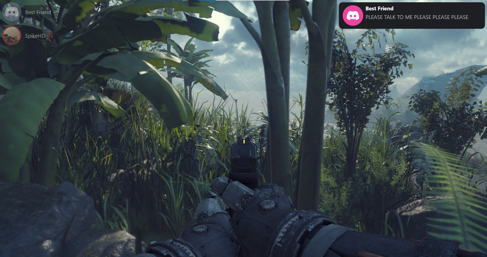

I've always liked the *idea* of Discord's overlay, but I always found it a smidge clunky. I've also been gaming entirely on Linux for the past few years which has meant
I have no access to the official overlay anyways. There are a couple alternatives out there, but they didn't really speak to me for one reason or another[^1].

After having the itch but never the reason, an [issue was raised in Dorion](https://github.com/SpikeHD/Dorion/issues/326) requesting the exact thing I'd been mulling over
for the last while, and it gave me the push to finally look into how one might build such an application. Now that Orbolay is in a pretty good state, I thought I'd share
how I created it!

# Communicating with Discord

Before one can display data, one needs... data. Discord provides several ways to ask for application state, such as a [WebSocket](https://docs.discord.food/topics/rpc#websocket-transport)
and [IPC](https://docs.discord.food/topics/rpc#ipc-transport). I opted for IPC, mostly just as preference, and also because there is a great library for cross-platform socket handling
called [interprocess](https://docs.rs/interprocess/latest/interprocess/).

First, we find a valid open Discord socket:

```rust
fn try_create_stream() -> Result<LocalSocketStream, Box<dyn std::error::Error>> {
  #[cfg(unix)]
  {
    let candidates = [
      std::env::var("XDG_RUNTIME_DIR").ok(),
      Some(format!(
        "{}/app/com.discordapp.Discord/",
        std::env::var("XDG_RUNTIME_DIR").unwrap_or_else(|_| "/tmp".into())
      )),
      std::env::var("TMPDIR").ok(),
      std::env::var("TMP").ok(),
      std::env::var("TEMP").ok(),
      Some("/tmp".to_string()),
    ];

    for dir in candidates.into_iter().flatten() {
      for i in 0..10 {
        let path = format!("{}/discord-ipc-{}", dir, i);

        if let Ok(stream) = LocalSocketStream::connect(path.to_fs_name::<GenericFilePath>()?) {
          return Ok(stream);
        }
      }
    }
  }

  #[cfg(windows)]
  {
    for i in 0..10 {
      let path = format!("discord-ipc-{}", i);
      let path = path.to_ns_name::<GenericNamespaced>()?;

      if let Ok(stream) = LocalSocketStream::connect(path) {
        return Ok(stream);
      }
    }
  }

  Err("Could not connect to any Discord IPC socket".into())
}
```

Then, we handshake using a special opcode, letting Discord know we exist, and taking a strategy from [Discover](https://github.com/trigg/Discover), we spoof StreamKit
by building an authorization request using it's client ID:

```rust
pub fn build_rpc_authorize_request() -> serde_json::Value {
  json!({
    "cmd": "AUTHORIZE",
    "args": {
      "client_id": "207646673902501888",
      "scopes": ["rpc", "rpc.voice.write", "messages.read", "rpc.notifications.read"],
      "prompt": "none"
    },
    "nonce": "helloworld"
  })
}
```

When we send this initial autorization request, we get an auth code that is sent to `https://streamkit.discord.com/overlay/token`, which gives us a token...

```rust
pub fn extract_auth_code(code: &str) -> Option<String> {
  const ATTEMPTS: u8 = 3;
  let url = Url::parse("https://streamkit.discord.com/overlay/token").ok()?;
  let body = json!({
    "code": code,
  });

  for attempt in 1..ATTEMPTS + 1 {
    let mut response = ureq::post(url.as_str())
      .header("Content-Type", "application/json")
      .send(&body.to_string())
      .ok()?;
    let body = response.body_mut();
    let body = body.read_to_string().ok()?;
    let parsed: serde_json::Value = serde_json::from_str(&body).ok()?;
    if let Some(token) = parsed.get("access_token").and_then(|t| t.as_str()) {
      return Some(token.to_string());
    }

    log!(
      "Failed to extract access token from StreamKit response, attempt {}/{}",
      attempt,
      ATTEMPTS
    );
  }

  error!(
    "Failed to extract access token from StreamKit response after {} attempts",
    ATTEMPTS
  );

  None
}
```

...that we can send back to Discord in the final authorization step:

```rust
pub fn build_rpc_authenticate_request(access_token: impl Into<String>) -> serde_json::Value {
  json!({
    "cmd": "AUTHENTICATE",
    "args": {
      "access_token": access_token.into()
    },
    "nonce": "helloworld"
  })
}
```

Now we're good to go!

Commands are a simple format, they have a `cmd`, `args`, and a `nonce`. The [discord.food](docs.discord.food) docs are an excellent user-made resource for exactly how this all works, but the gist is that
we can tell Discord to do anything by sending over a very simple JSON payload through the socket. For example, muting oneself is as simple as sending:

```json
{
  "cmd": "SET_VOICE_SETTINGS",
  "args": {
    "mute": true
  },
  "nonce": "SET_VOICE_SETTINGS" // This can be whatever
}
```

Not only this, but we actually get a lot of data sent to us periodically so long as we subscribe to it with yet another command. For example, we can subscribe to `VOICE_CHANNEL_SELECT`, then when a VC is selected
by the user, we can react by subscribing to all related events:

```rust
pub fn subscribe_voice_channel(
  stream: &mut LocalSocketStream,
  channel_id: &str,
) -> Result<(), Box<dyn std::error::Error>> {
  subscribe_channel(stream, "VOICE_STATE_CREATE", channel_id)?;
  subscribe_channel(stream, "VOICE_STATE_UPDATE", channel_id)?;
  subscribe_channel(stream, "VOICE_STATE_DELETE", channel_id)?;
  subscribe_channel(stream, "SCREENSHARE_STATE_UPDATE", channel_id)?;
  subscribe_channel(stream, "SPEAKING_START", channel_id)?;
  subscribe_channel(stream, "SPEAKING_STOP", channel_id)?;
  Ok(())
}
```

## I Heard Orbolay Supports 3rd-party Clients?

It sure does! Orbolay has a built-in websocket server for use with third-party applications like web Discord, Dorion, Vesktop, etc. It works basically the same, with the caveat that the 3rd party client
needs some sort of modification to foster the communication. For example, the [shelter](shelter.uwu.network) [plugin](https://github.com/SpikeHD/shelter-plugins#orbolay-bridge) subscribes to Flux
events and relays them through the websocket:

```ts
export const onLoad = () => {
  // ...
  createWebsocket()

  fluxDispatcher.subscribe('SPEAKING', handleSpeaking)
  // ...
}

const handleSpeaking = (dispatch) => {
  ws?.send?.(
    JSON.stringify({
      cmd: 'VOICE_STATE_UPDATE',
      state: {
        userId: dispatch.userId,
        speaking: dispatch.speakingFlags === 1,
      },
    })
  )
}
```

# The Overlay Part

Great, now we have all the data we'd ever want in the world, how do we show it? Well, historically, there are two ways:

1. Create a transparent, click-through window that slaps itself over the whole screen or
2. Hook into the graphics pipeline of a running game and display it there

As you might imagine, creating a transparent window is significantly easier and less complex, so that is what I opted to go for. It also means Orbolay isn't limited to existing
just within applications, it can exist on your desktop as well!

## Graphics and Windows

To draw to the screen I use [Freya](https://freyaui.dev/), a super cool library based on Skia that offers a declarative, crossplatform GUI. It's got state, hooks,
everything you'd want as a web-developer-by-trade-backend-developer-by-dream, not that I'd know.

Behind the scenes it uses [winit](https://github.com/rust-windowing/winit) for showing the Window, which gives us easy access to what we'd need to create a transparent,
click-through window... with a little bit of help:

```rust
LaunchConfig::new()
  .with_window(
    WindowConfig::new(app)
      .with_title("orbolay")
      .with_decorations(false)
      .with_transparency(true)
      .with_background(Color::TRANSPARENT)
      .with_window_attributes(move |mut w, _event_loop| {
        w = w
          .with_inner_size(window_size)
          .with_resizable(false)
          .with_window_level(WindowLevel::AlwaysOnTop)
          .with_position(PhysicalPosition::new(
            monitor_position.0,
            monitor_position.1,
          ));

        #[cfg(target_os = "windows")]
        {
          w = w.with_skip_taskbar(true);
        }

        #[cfg(target_os = "linux")]
        {
          use winit::platform::wayland::WindowAttributesExtWayland;
          use winit::platform::x11::{WindowAttributesExtX11, WindowType};

          w = WindowAttributesExtX11::with_name(w, "orbolay", "orbolay")
            .with_x11_window_type(vec![WindowType::Utility])
            .with_override_redirect(true);
          w = WindowAttributesExtWayland::with_name(w, "orbolay", "orbolay");
        }

        w
      }),
  ),
```

And of course, since we need to display this over the entire screen, we calculate the window size based on the selected monitor's size:

```rust
pub fn window_size_for_display(display: &DisplayInfo) -> PhysicalSize<f64> {
  let monitor_size = (display.width, display.height);

  PhysicalSize::new(
    (monitor_size.0 + 1) as f64 * display.scale_factor as f64,
    (monitor_size.1 - 1) as f64 * display.scale_factor as f64,
  )
}
```

Oh? Whats that `+1` and `-1` doing there? Apparently on AMD GPUs the driver will stop drawing the desktop when it thinks it's being covered completely by another window[^2]. Unfortunately, it's quite stupid, as
this means even though the window is transparent, everything behind the overlay turns pitch black. The `-1` also exists to [keep Windows' hide-taskbar option working](https://github.com/SpikeHD/Orbolay/issues/29),
even when the window allows mouse events to pass through... sigh...

Displaying the contents itself is pretty easy. Components are built as structs with a `render` function, and are created using function chaining. For example, here's what a user row looks like:

```rust
impl Component for UserRow {
  fn render(&self) -> impl IntoElement {
    let is_right_aligned = self.is_right_aligned;
    let is_speaking = self.user.voice_state == UserVoiceState::Speaking;

    let opacity = if !is_speaking && (self.is_voice_semitransparent && !self.is_open) {
      0.5
    } else {
      1.0
    };

    // This is a component
    let label = UserLabel {
      user: self.user.clone(),
    };
    // This is a component as well
    let icon = AvatarIcon {
      user: self.user.clone(),
    };

    let row = rect()
      .direction(Direction::Horizontal)
      .main_align(Alignment::Start)
      .cross_align(Alignment::Center)
      .height(Size::px(50.))
      .margin(Gaps::new_all(6.))
      .opacity(opacity);

    if is_right_aligned {
      row.child(label).child(icon)
    } else {
      row.child(icon).child(label)
    }
  }
}
```

To make the controls work, we detect a (customizable!) global keybind and set click-through accordingly. Under almost every circumstance, calling `window.set_cursor_hittest(true/false)` is enough to
change whether the overlay consumes mouse click events, EXCEPT on ***KDE X11 ONLY***[^3], which requires the overlay to shrink and grow it's input shape accordingly:

```rust
let _ = w.set_cursor_hittest(clickable);

// On X11/KDE, set_cursor_hittest is not enough for click-through
#[cfg(target_os = "linux")]
{
  use winit::raw_window_handle::{HasWindowHandle, RawWindowHandle};
  use x11rb::{
    connection::Connection,
    protocol::{
      shape::{self, ConnectionExt as _},
      xproto::ClipOrdering,
    },
  };

  let Ok(handle) = w.window_handle() else {
    warn!("Failed to get window handle");
    return;
  };

  let xid: u32 = match handle.as_raw() {
    RawWindowHandle::Xcb(h) => h.window.get(),
    RawWindowHandle::Xlib(h) => h.window as u32,
    //  Wayland/etc. doesn't need this hack
    _ => return,
  };

  let Ok((conn, _)) = x11rb::connect(None) else {
    warn!("Failed to connect to X server");
    return;
  };

  let rects: &[x11rb::protocol::xproto::Rectangle] = if clickable {
    &[x11rb::protocol::xproto::Rectangle {
      x: 0,
      y: 0,
      width: u16::MAX,
      height: u16::MAX,
    }]
  } else {
    &[]
  };

  let _ = conn.shape_rectangles(
    shape::SO::SET,
    shape::SK::INPUT,
    ClipOrdering::UNSORTED,
    xid,
    0,
    0,
    rects,
  );
  let _ = conn.flush();
}
```

And don't even get me STARTED on the issues with Hyprland[^4][^5]!

# UI Communication

Orbolay is special in that it also has mute/deafen/soundboard/leave call controls, and these are handled by - you guessed it - yet more commands. Simply put, the UI is able to send
commands between it's UI thread and the transport thread using [flume](https://docs.rs/flume/latest/flume/) channels. For example, the UI can send a `TOGGLE_MUTE` command:

```rust
impl Component for VoiceControls {
  fn render(&self) -> impl IntoElement {
    // ...

    rect()
      // ...
      .child(ControlButton {
        icon: if is_muted || is_deafened {
          MUTED_SVG
        } else {
          MUTE_SVG
        },
        is_red: is_muted || is_deafened,
        on_click: (move |()| {
          app_state.write().send(BridgeMessage {
            cmd: "TOGGLE_MUTE".to_string(),
            data: Value::Null,
          })
        })
        .into(),
      })
  }
}
```

and the transport thread can ingest that and send it over to the IPC socket:

```rust
match msg.cmd.as_str() {
  "TOGGLE_MUTE" => {
    let muted = state
      .voice_users
      .iter()
      // Get the current user
      .find(|user| user.id == state.user_id)
      // Are they muted?
      .map(|user| user.voice_state == UserVoiceState::Muted)
      .unwrap_or(false);

    set_muted(stream, !muted)?;
    return Ok(());
  }
  // ...
}
```

# Handling Configuration Changes

To simplify the configuration handling, the configuration window itself is basically an entirely separate process that writes directly to the config file. Having to restart Orbolay after every pixel
offset change would be tedious and stupid though, so to hot-reload the configuration we can use OS-level notifications like `inotify`!

In another thread, we keep an eye on the config file, and when it changes, we redraw the UI on the fly! Simple, and without any IPC requirements of it's own!

```rust

pub fn start_config_watcher(shared: SharedAppState, redraw_tx: flume::Sender<()>) {
  log!("Starting config file notification thread");
  std::thread::spawn(move || {
    let (tx, rx) = mpsc::channel::<Result<Event>>();
    let mut watcher = notify::recommended_watcher(tx);
    let config_path = config_dir().join("config.json");

    watcher.watch(&config_path, notify::RecursiveMode::NonRecursive)

    loop {
      match rx.recv() {
        Ok(Ok(event)) => {
          if !event.kind.is_modify() {
            continue;
          }

          if event.paths.iter().any(|p| p == &config_path) {
            log!("Config file changed, reloading...");
            if let Some(new_config) = load_config() {
              let mut state = shared.write().unwrap();
              state.config = new_config;
              redraw_tx.send(()).ok();
              log!("Config reloaded successfully");
            } else {
              warn!("Failed to reload config file");
            }
          }
        }
        // ...
      }
    }
  });
}
```

# Rendering the Soundboard

I know this one doesn't seem interesting, and that's because it *almost* isn't, but... well, you wouldn't believe how complex font formats and font format features get.

In case you weren't aware, Discord fonts are actually [Twemoji](https://github.com/twitter/twemoji), an open-source emoji resource developed by Twitter/X the everything app.
Twemoji doesn't distribute a standard font file, only a JavaScript library(??) and... well actually that's it.

Some people have taken it upon themselves to distribute a standard font package, like [13rac1/twemoji-color-font](https://github.com/13rac1/twemoji-color-font). Problem is,
this font file depends on a feature called "SVGinOT". This feature, co-authored by Adobe and Mozilla, is unfortunately not very well supported, and is DEFINITELY not supported
in Skia/Freya's rendering.

So, out of options, I look elsewhere and I find none other than the [Alpine Linux `font-twemoji` package](https://pkgs.alpinelinux.org/package/edge/community/x86/font-twemoji). This
is apparently a [custom build of the font](https://git.sr.ht/~whynothugo/twemoji.ttf) using regular TrueType format, and properly renders in Freya! Thank you [whynothugo](https://git.sr.ht/~whynothug)!

# That's It!

Orbolay is, of course, [entirely open-source](https://github.com/SpikeHD/Orbolay), so if it interests you, feel free to dig into it! It really isn't that complicated at the end of the day,
just a lot of back-and-forth IPC communication with some UI sugar on top.

Orbolay has been super fulfilling to work on, and it's been a very interesting challenge figuring out all the different little tweaks that are needed to ensure it works the same
on every platform. If it interests you, give it a try! And if you want something changed or added, like always, PRs and issues are always welcome :)

[^1]: [Overlayed](https://overlayed.dev/) is a Tauri application (therefore webview-based) which felt like overkill, and [Discover](https://github.com/trigg/Discover),
while made with GTK3, only shows users and doesn't offer any advanced controls (like self-muting)
[^2]: https://discourse.glfw.org/t/black-screen-when-setting-window-to-transparent-and-size-to-1920x1080/2585/5. I'm pretty sure this didn't even fix the issue for everyone
[^3]: https://github.com/SpikeHD/Orbolay/issues/24
[^4]: https://github.com/SpikeHD/Orbolay/issues/22
[^5]: https://github.com/SpikeHD/Orbolay/issues/28
